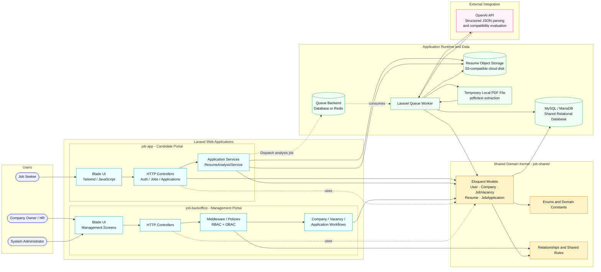
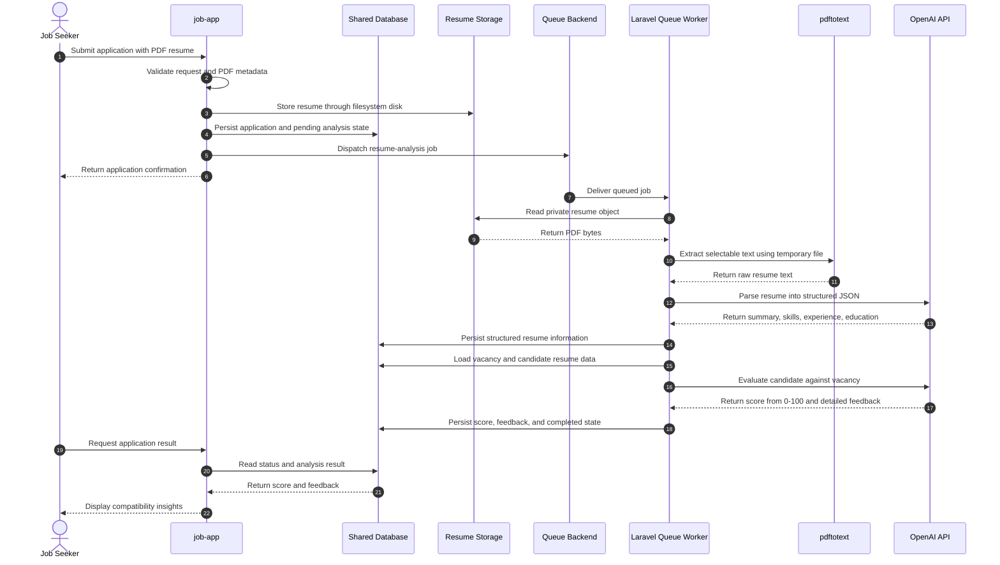

# 🚀 Job Vacancies Platform

<p align="center">
  <strong>AI-powered recruitment infrastructure for smarter hiring decisions</strong>
</p>

<p align="center">
  A Laravel monorepo that connects job seekers, employers, and administrators through intelligent job discovery, resume analysis, compatibility scoring, and streamlined hiring workflows.
</p>

<p align="center">
  <a href="https://github.com/Ammar-1993/Job_Vacancies_Platform">Repository</a> ·
  <a href="#-system-architecture">Architecture</a> ·
  <a href="#-core-features">Features</a> ·
  <a href="#-getting-started">Getting Started</a>
</p>

---

## 📖 Project Overview

**Job Vacancies Platform** is a next-generation recruitment ecosystem designed to improve the way talent and employers connect. Instead of acting as a traditional job board, the platform combines structured vacancy management with AI-assisted resume evaluation to help candidates understand their fit and help employers prioritize relevant applications.

The system is delivered as a **Laravel monorepo** with clearly separated application responsibilities:

- **Candidate experience:** Discover opportunities, submit applications, and receive AI-powered feedback.
- **Employer experience:** Manage companies and vacancies, review applicants, and make informed hiring decisions.
- **Administrative governance:** Control users, platform data, access permissions, and operational workflows.
- **Shared domain foundation:** Maintain consistent models, enums, relationships, and business rules across applications.

### 🎯 Product Goals

1. Reduce friction throughout the candidate application journey.
2. Provide employers with structured, actionable applicant insights.
3. Automate the first stage of resume-to-vacancy comparison.
4. Protect sensitive candidate information through private storage and access control.
5. Preserve a single source of truth for shared recruitment data.

## ✨ Core Features

### For Job Seekers

- Search and filter vacancies by employment type, location, salary, and other attributes.
- Create and manage a secure candidate profile.
- Submit applications with PDF resume validation.
- Receive an AI-generated compatibility score and improvement recommendations.
- Track application progress through statuses such as pending, accepted, and rejected.

### For Employers and HR Teams

- Create and manage company profiles and job vacancies.
- Review applications from a centralized management portal.
- Use AI-generated compatibility insights to support applicant prioritization.
- Manage vacancy and application workflows with ownership-based restrictions.
- Access operational information through management dashboards and analytics.

### For Administrators

- Manage users, companies, vacancies, and applications.
- Enforce Role-Based Access Control (RBAC).
- Enforce Ownership-Based Access Control (OBAC) for company owners.
- Preserve historical records through soft deletion strategies.
- Maintain data quality for the public candidate portal.

## 🧭 System Architecture

The platform follows a **modular monorepo architecture**. `job-app` and `job-backoffice` are independent Laravel applications that consume `job-shared` through a local Composer path repository. Both applications use the shared relational database, while candidate resumes are stored through Laravel's filesystem abstraction and can be backed by an S3-compatible cloud disk.

The diagram intentionally separates **user-facing applications**, the **shared domain kernel**, **runtime infrastructure**, and **external services**. Solid arrows represent normal request or data dependencies; dashed arrows represent asynchronous processing.



### 🔄 Resume Analysis and Compatibility Scoring



### 🧩 Architectural Responsibilities

| Component | Responsibility |
| --- | --- |
| `job-app` | Candidate registration, job discovery, filtering, resume upload, applications, and result tracking. |
| `job-backoffice` | Administration, company management, vacancy management, applicant review, and operational dashboards. |
| `job-shared` | Shared Composer package containing Eloquent models, enums, relationships, and domain rules. |
| Shared database | Persists users, companies, vacancies, resumes, applications, statuses, and AI results. |
| Resume storage | Stores uploaded PDF files through Laravel's filesystem abstraction; production deployments can use an S3-compatible disk. |
| Queue worker | Runs resume parsing and AI evaluation outside the initial web request. |
| `ResumeAnalysisService` | Extracts PDF text, requests structured resume data, evaluates job fit, retries selected OpenAI failures, and validates JSON responses. |
| OpenAI API | Parses resume information and returns compatibility score and feedback. |

### 🔐 Security and Data Boundaries

- RBAC and OBAC are enforced in the management portal before company and vacancy operations are executed.
- Resume files are handled through a non-public storage path and should be exposed only through authorized application responses.
- UUID primary keys reduce predictable identifier enumeration.
- Soft deletes preserve historical records without immediate destructive deletion.
- OpenAI calls execute outside the user-facing request when the queue worker is enabled.
- `OPENAI_API_KEY`, storage credentials, database credentials, and application secrets must remain in environment configuration.
- AI scores are decision-support signals and should not replace human review or fair hiring practices.

## 🏗️ Repository Structure

```text
Job_Vacancies_Platform/
├── job-app/          # Public candidate portal
├── job-backoffice/   # Admin and employer management portal
├── job-shared/       # Shared models, enums, and domain logic
└── README.md
```

## ⚙️ Technology Stack

| Layer | Technology | Purpose |
| --- | --- | --- |
| Backend | Laravel 12, PHP 8.2+ | MVC application framework and domain workflows |
| Presentation | Blade, Tailwind CSS, JavaScript | Responsive candidate and management interfaces |
| Persistence | MySQL 8.0+ / MariaDB 10.10+ | Shared relational recruitment data store |
| AI integration | OpenAI API | Resume parsing and vacancy compatibility insights |
| File storage | Laravel Filesystem, S3-compatible storage | Private resume persistence |
| Background processing | Laravel Queues | Non-blocking AI analysis and asynchronous jobs |
| Dependency management | Composer, NPM | PHP packages and frontend asset tooling |
| Development environment | Docker-compatible setup | Reproducible local infrastructure |

## 🚀 Getting Started

### Prerequisites

- PHP 8.2 or higher
- Composer
- Node.js and NPM
- MySQL 8.0+ or MariaDB 10.10+
- Required PHP extensions: BCMath, Ctype, Fileinfo, JSON, Mbstring, OpenSSL, PDO, Tokenizer, and XML
- OpenAI API key for AI analysis features
- `pdftotext` available to the application runtime for selectable-text PDF extraction

### Candidate Portal

```bash
git clone https://github.com/Ammar-1993/Job_Vacancies_Platform.git
cd Job_Vacancies_Platform/job-app
composer install
composer dump-autoload
cp .env.example .env
npm install
npm run build
php artisan storage:link
php artisan serve
```

### Management Portal

```bash
cd ../job-backoffice
composer install
composer dump-autoload
cp .env.example .env
npm install
npm run build
php artisan migrate --seed
php artisan serve --port=8001
```

Configure both `.env` files to use the shared database. Configure the candidate portal's OpenAI and storage settings according to the selected deployment environment. Never commit secrets to version control.

### Background Processing

Run a queue worker so resume analysis jobs can be processed:

```bash
php artisan queue:work
```

## 🧪 Development and Contribution Guidelines

1. Fork the repository.
2. Create a focused feature branch.
3. Implement and test the change in the relevant application.
4. Update `job-shared` when changing shared models, enums, or domain rules.
5. Run formatting, automated tests, and relevant application checks.
6. Push the branch and open a pull request with a clear technical description.

## ⚠️ Security Notes

- Development seed credentials are for local demonstration only and must be changed before production deployment.
- Do not commit `.env`, API keys, database passwords, or uploaded resumes.
- Keep resume files on private storage and expose them only through authorized application flows.
- Review OpenAI data-handling requirements before using the platform with production candidate data.

---

<div align="center">

Developed with ❤️ by Engineer Ammar Al-Najjar

</div>
