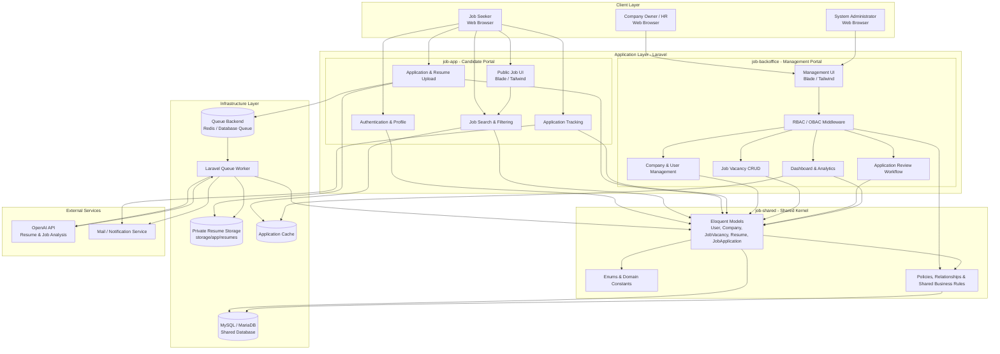
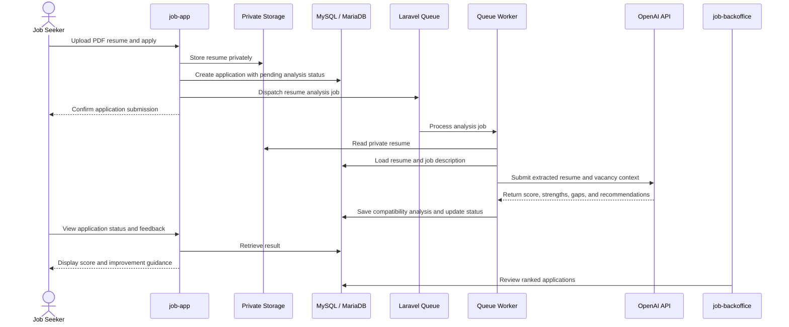

# 🚀 Job Vacancies Platform

An AI-powered recruitment ecosystem that connects job seekers with employers through intelligent job matching, resume analysis, compatibility scoring, and end-to-end hiring management.

## 🧭 System Architecture

The platform is organized as a Laravel monorepo composed of a public candidate portal, a protected employer/admin backoffice, and a shared domain kernel. Both applications use the same database and shared models while keeping their responsibilities and access boundaries separated.



### 🔄 Core Resume Analysis Flow



### 🧩 Architectural Responsibilities

| Component | Responsibility |
| --- | --- |
| `job-app` | Candidate registration, job discovery, filtering, resume upload, applications, and status tracking. |
| `job-backoffice` | Administration, company management, vacancy management, applicant review, and platform analytics. |
| `job-shared` | Single source of truth for Eloquent models, enums, relationships, policies, and shared domain rules. |
| MySQL / MariaDB | Persistent storage for users, companies, vacancies, resumes, applications, and AI analysis results. |
| Laravel Queue Worker | Asynchronous processing of resume parsing and AI compatibility analysis. |
| Private Resume Storage | Keeps uploaded resumes inaccessible to the public web root and protects candidate data. |
| OpenAI API | Performs natural-language analysis of resumes against job descriptions. |

### 🔐 Security and Data Boundaries

- Role-Based Access Control separates administrators from company owners and candidates.
- Ownership-Based Access Control limits company owners to their own companies, vacancies, and applications.
- Resumes are stored on a private disk rather than public web storage.
- UUID primary keys reduce predictable identifier enumeration.
- Soft deletes preserve historical records without immediately destroying business data.
- AI processing is asynchronous so external API calls do not block the application request.
- Secrets such as `OPENAI_API_KEY` must remain in environment configuration and must never be committed.

## 🏗️ Repository Structure

```text
Job_Vacancies_Platform/
├── job-app/          # Public candidate portal
├── job-backoffice/   # Admin and employer management portal
├── job-shared/       # Shared models, enums, and domain logic
└── README.md
```

## ✨ Main Capabilities

- Smart job search by type, location, salary, and other vacancy attributes.
- One-click applications with PDF resume validation.
- AI-generated compatibility score and actionable feedback.
- Candidate application tracking with pending, accepted, and rejected states.
- Company and vacancy management for employers and administrators.
- Centralized application review and operational analytics.
- Shared domain models across both Laravel applications.

## ⚙️ Technology Stack

- **Backend:** Laravel 12, PHP 8.2+
- **Frontend:** Blade, Tailwind CSS, JavaScript
- **Database:** MySQL 8.0+ or MariaDB 10.10+
- **AI:** OpenAI API
- **Asynchronous processing:** Laravel Queues
- **Environment:** Docker-compatible development setup

## 🚀 Development Notes

Install dependencies independently inside `job-app` and `job-backoffice`, configure each `.env` file to use the shared database, build frontend assets, and run a queue worker for AI analysis:

```bash
php artisan queue:work
```

Never use the development seed credentials in production. Change all default passwords and configure production secrets before deployment.

## 🤝 Contribution

1. Fork the repository.
2. Create a feature branch.
3. Implement and test your changes.
4. Push the branch and open a pull request.
5. When changing shared models or domain rules, update `job-shared` so both applications remain consistent.

---

<div align="center">

Developed with ❤️ by Engineer Ammar Al-Najjar

</div>
