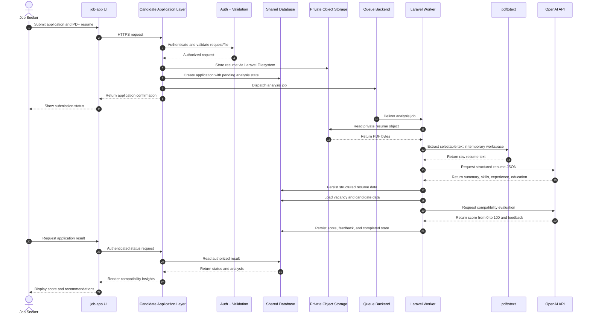

# 🚀 Job Vacancies Platform

<p align="center">
  <strong>AI-powered recruitment infrastructure for smarter hiring decisions</strong>
</p>

<p align="center">
  A Laravel monorepo that connects job seekers, employers, and administrators through intelligent job discovery, resume analysis, compatibility scoring, and streamlined hiring workflows.
</p>

<p align="center">
  <a href="https://github.com/Ammar-1993/Job_Vacancies_Platform">Repository</a> ·
  <a href="#-enterprise-system-architecture">Architecture</a> ·
  <a href="#-core-features">Features</a> ·
  <a href="#-getting-started">Getting Started</a>
</p>

---

## 📖 Project Overview

**Job Vacancies Platform** is a next-generation recruitment ecosystem designed to improve the way talent and employers connect. Instead of acting as a traditional job board, the platform combines structured vacancy management with AI-assisted resume evaluation to help candidates understand their fit and help employers prioritize relevant applications.

The system is delivered as a **Laravel monorepo** with clearly separated application responsibilities:

- **Candidate experience:** Discover opportunities, submit applications, and receive AI-powered feedback.
- **Employer experience:** Manage companies and vacancies, review applicants, and make informed hiring decisions.
- **Administrative governance:** Control users, platform data, access permissions, and operational workflows.
- **Shared domain foundation:** Maintain consistent models, enums, relationships, and business rules across applications.

## ✨ Core Features

### For Job Seekers

- Search and filter vacancies by employment type, location, salary, and other attributes.
- Create and manage a secure candidate profile.
- Submit applications with PDF resume validation.
- Receive an AI-generated compatibility score and improvement recommendations.
- Track application progress through statuses such as pending, accepted, and rejected.

### For Employers and HR Teams

- Create and manage company profiles and job vacancies.
- Review applications from a centralized management portal.
- Use AI-generated compatibility insights to support applicant prioritization.
- Manage vacancy and application workflows with ownership-based restrictions.
- Access operational information through management dashboards and analytics.

### For Administrators

- Manage users, companies, vacancies, and applications.
- Enforce Role-Based Access Control (RBAC).
- Enforce Ownership-Based Access Control (OBAC) for company owners.
- Preserve historical records through soft deletion strategies.
- Maintain data quality for the public candidate portal.

## 🏛️ Enterprise System Architecture

The platform uses a **modular monorepo architecture** consisting of two independent Laravel applications and one shared Composer package:

- `job-app` is the public candidate-facing application.
- `job-backoffice` is the protected employer and administration application.
- `job-shared` is the shared domain kernel consumed through a local Composer path repository.
- Both applications use the same relational database and domain models.
- Resume files are handled through Laravel Filesystem and stored on an S3-compatible cloud disk.
- Resume parsing and AI evaluation are isolated from the synchronous request path through Laravel queues.

The diagram below presents the system using enterprise architecture boundaries: actors, presentation, application services, domain, infrastructure, external integrations, and security controls.

```mermaid
flowchart TB
    %% =============================
    %% External actors and channels
    %% =============================
    subgraph Actors[Actors and Access Channels]
        Candidate([Job Seeker])
        Employer([Company Owner / HR])
        Admin([System Administrator])
        Browser[Web Browser<br/>HTTPS]
    end

    Candidate --> Browser
    Employer --> Browser
    Admin --> Browser

    %% =============================
    %% Public and protected trust zones
    %% =============================
    subgraph TrustZone[Application Trust Boundary]
        subgraph Edge[Web Presentation Layer]
            CandidateUI[Candidate Portal<br/>Blade + Tailwind + JavaScript]
            BackofficeUI[Employer / Admin Portal<br/>Blade + Tailwind + JavaScript]
        end

        subgraph AppLayer[Application Layer - Laravel]
            CandidateApp[job-app<br/>Routes + HTTP Controllers]
            BackofficeApp[job-backoffice<br/>Routes + HTTP Controllers]
            CandidateServices[Candidate Application Services<br/>Jobs / Applications / Auth]
            BackofficeServices[Management Services<br/>Companies / Vacancies / Reviews]
        end

        subgraph Security[Cross-cutting Security Controls]
            Auth[Authentication]
            RBAC[Role-Based Access Control]
            OBAC[Ownership-Based Access Control]
            Validation[Request and File Validation]
            Policies[Authorization Policies]
        end

        subgraph Domain[job-shared - Shared Domain Kernel]
            Models[Eloquent Models<br/>User · Company · JobVacancy<br/>Resume · JobApplication]
            Enums[Enums and Status Values]
            Relations[Relationships and Domain Rules]
        end
    end

    %% =============================
    %% Platform infrastructure
    %% =============================
    subgraph Platform[Platform Infrastructure]
        Database[(MySQL / MariaDB<br/>Shared Relational Database)]
        Queue[(Queue Backend<br/>Database or Redis)]
        Worker[Laravel Queue Worker]
        ObjectStorage[(S3-compatible Object Storage<br/>Private Resume Bucket)]
        TempWorkspace[Ephemeral Worker Workspace<br/>Temporary PDF file]
        PDFParser[pdftotext<br/>PDF text extraction]
        Logs[Application Logs<br/>Monitoring and audit trail]
    end

    %% =============================
    %% External integrations
    %% =============================
    subgraph Integrations[External Integration Boundary]
        OpenAI[OpenAI API<br/>Resume parsing and fit evaluation]
    end

    %% =============================
    %% Inbound request paths
    %% =============================
    Browser --> CandidateUI
    Browser --> BackofficeUI
    CandidateUI --> CandidateApp
    BackofficeUI --> BackofficeApp

    CandidateApp --> Auth
    BackofficeApp --> Auth
    CandidateApp --> Validation
    BackofficeApp --> Validation
    BackofficeApp --> RBAC
    BackofficeApp --> OBAC
    RBAC --> Policies
    OBAC --> Policies

    CandidateApp --> CandidateServices
    CandidateServices --> Models
    BackofficeApp --> BackofficeServices
    BackofficeServices --> Models
    BackofficeServices --> Policies

    %% =============================
    %% Shared domain and persistence
    %% =============================
    Models --> Enums
    Models --> Relations
    Models --> Database
    Policies --> Models

    %% =============================
    %% Resume submission and async processing
    %% =============================
    CandidateServices --> ObjectStorage
    CandidateServices -. "Dispatch analysis job" .-> Queue
    Queue -. "Consume queued job" .-> Worker
    Worker --> ObjectStorage
    Worker --> TempWorkspace
    TempWorkspace --> PDFParser
    PDFParser --> Worker
    Worker --> OpenAI
    OpenAI --> Worker
    Worker --> Models
    Worker --> Database

    %% =============================
    %% Observability
    %% =============================
    CandidateApp -.-> Logs
    BackofficeApp -.-> Logs
    Worker -.-> Logs

    %% =============================
    %% Visual language
    %% =============================
    classDef actor fill:#eef2ff,stroke:#4f46e5,color:#111827,stroke-width:1px;
    classDef presentation fill:#e0f2fe,stroke:#0284c7,color:#111827,stroke-width:1px;
    classDef application fill:#ecfeff,stroke:#0891b2,color:#111827,stroke-width:1px;
    classDef security fill:#fef2f2,stroke:#dc2626,color:#111827,stroke-width:1px;
    classDef domain fill:#fef3c7,stroke:#d97706,color:#111827,stroke-width:1px;
    classDef infrastructure fill:#f0fdf4,stroke:#16a34a,color:#111827,stroke-width:1px;
    classDef integration fill:#fdf2f8,stroke:#db2777,color:#111827,stroke-width:1px;

    class Candidate,Employer,Admin,Browser actor;
    class CandidateUI,BackofficeUI presentation;
    class CandidateApp,BackofficeApp,CandidateServices,BackofficeServices application;
    class Auth,RBAC,OBAC,Validation,Policies security;
    class Models,Enums,Relations domain;
    class Database,Queue,Worker,ObjectStorage,TempWorkspace,PDFParser,Logs infrastructure;
    class OpenAI integration;
```



### 🧱 Architecture Layers and Responsibilities

| Layer | Components | Responsibility |
| --- | --- | --- |
| Access and presentation | Browser, Blade, Tailwind, JavaScript | Provides candidate, employer, and administrator interfaces over HTTPS. |
| Application | `job-app`, `job-backoffice`, controllers, services | Orchestrates use cases, validates requests, and coordinates domain and infrastructure services. |
| Security | Authentication, RBAC, OBAC, policies, validation | Verifies identity, roles, ownership, permissions, and uploaded file constraints. |
| Domain | `job-shared`, Eloquent models, enums, relationships | Provides the shared recruitment vocabulary and single source of truth for business data. |
| Data and storage | MySQL/MariaDB, private object storage | Persists transactional records and protects uploaded resumes. |
| Asynchronous processing | Queue backend, Laravel worker | Executes long-running resume parsing and AI evaluation outside the web request. |
| External integration | OpenAI API | Produces structured resume information, compatibility scores, and feedback. |
| Operations | Logs and monitoring hooks | Captures application, worker, and integration events for troubleshooting. |

### 🔐 Trust Boundaries and Security Controls

1. **Public access boundary:** Candidates use `job-app`; only authenticated candidate operations can access personal applications and analysis results.
2. **Protected management boundary:** Employers and administrators use `job-backoffice`; authentication, RBAC, and OBAC are applied before management operations.
3. **Domain boundary:** Both applications consume `job-shared`; shared models and rules prevent divergent representations of recruitment data.
4. **Data boundary:** Resumes are stored outside the public web root through the filesystem abstraction and should be served only after authorization.
5. **Integration boundary:** OpenAI is accessed by the worker using server-side credentials; API keys are never exposed to browsers.
6. **Processing boundary:** Queue workers handle PDF extraction and AI calls asynchronously, preventing external latency from blocking application submission.

### 🔄 Enterprise Data Flow: Resume Analysis



### 🧩 Component Responsibilities

| Component | Responsibility |
| --- | --- |
| `job-app` | Candidate registration, job discovery, filtering, resume upload, applications, and result tracking. |
| `job-backoffice` | Administration, company management, vacancy management, applicant review, and operational dashboards. |
| `job-shared` | Shared Composer package containing Eloquent models, enums, relationships, and domain rules. |
| `ResumeAnalysisService` | Extracts PDF text, requests structured resume data, evaluates job fit, retries selected OpenAI failures, and validates JSON responses. |
| Shared database | Persists users, companies, vacancies, resumes, applications, statuses, and AI results. |
| Private object storage | Stores uploaded PDF resumes through Laravel Filesystem and an S3-compatible private disk. |
| Queue worker | Runs resume parsing and AI evaluation outside the initial web request. |
| OpenAI API | Parses resume information and returns compatibility score and feedback. |

## 🏗️ Repository Structure

```text
Job_Vacancies_Platform/
├── job-app/          # Public candidate portal
├── job-backoffice/   # Admin and employer management portal
├── job-shared/       # Shared models, enums, and domain logic
└── README.md
```

## ⚙️ Technology Stack

| Layer | Technology | Purpose |
| --- | --- | --- |
| Backend | Laravel 12, PHP 8.2+ | MVC application framework and domain workflows |
| Presentation | Blade, Tailwind CSS, JavaScript | Responsive candidate and management interfaces |
| Persistence | MySQL 8.0+ / MariaDB 10.10+ | Shared relational recruitment data store |
| AI integration | OpenAI API | Resume parsing and vacancy compatibility insights |
| File storage | Laravel Filesystem, S3-compatible storage | Private resume persistence |
| PDF processing | Spatie PDF-to-Text, `pdftotext` | Extracts selectable text from uploaded resumes |
| Background processing | Laravel Queues | Non-blocking AI analysis and asynchronous jobs |
| Dependency management | Composer, NPM | PHP packages and frontend asset tooling |
| Development environment | Docker-compatible setup | Reproducible local infrastructure |

## 🚀 Getting Started

### Prerequisites

- PHP 8.2 or higher
- Composer
- Node.js and NPM
- MySQL 8.0+ or MariaDB 10.10+
- Required PHP extensions: BCMath, Ctype, Fileinfo, JSON, Mbstring, OpenSSL, PDO, Tokenizer, and XML
- OpenAI API key for AI analysis features
- `pdftotext` available to the application runtime for selectable-text PDF extraction

### Candidate Portal

```bash
git clone https://github.com/Ammar-1993/Job_Vacancies_Platform.git
cd Job_Vacancies_Platform/job-app
composer install
composer dump-autoload
cp .env.example .env
npm install
npm run build
php artisan storage:link
php artisan serve
```

### Management Portal

```bash
cd ../job-backoffice
composer install
composer dump-autoload
cp .env.example .env
npm install
npm run build
php artisan migrate --seed
php artisan serve --port=8001
```

Configure both `.env` files to use the shared database. Configure the candidate portal's OpenAI and storage settings according to the selected deployment environment. Never commit secrets to version control.

### Background Processing

Run a queue worker so resume analysis jobs can be processed:

```bash
php artisan queue:work
```

## 🧪 Development and Contribution Guidelines

1. Fork the repository.
2. Create a focused feature branch.
3. Implement and test the change in the relevant application.
4. Update `job-shared` when changing shared models, enums, or domain rules.
5. Run formatting, automated tests, and relevant application checks.
6. Push the branch and open a pull request with a clear technical description.

## ⚠️ Security Notes

- Development seed credentials are for local demonstration only and must be changed before production deployment.
- Do not commit `.env`, API keys, database passwords, or uploaded resumes.
- Keep resume files on private storage and expose them only through authorized application flows.
- Review OpenAI data-handling requirements before using the platform with production candidate data.
- AI scores are decision-support signals and should not replace human review or fair hiring practices.

---

<div align="center">

Developed with ❤️ by Engineer Ammar Al-Najjar

</div>
